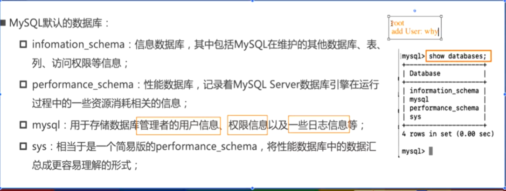

####
**数据库分类**
- 关系型数据库 MySQL
- 非关系型数据库 MongoDB redis

#### MySQL链接操作
- 配置环境变量
- mysql -u root -p
- password 
- 

#### 查看数据库

- SHOW DATABASES;

#### 创建数据库

- create databse xxxx;

#### 查看正在使用 哪个是数据库

- select database();

#### 使用摸个数据库

- use databaseName;

#### 创建表

- create table table_name;